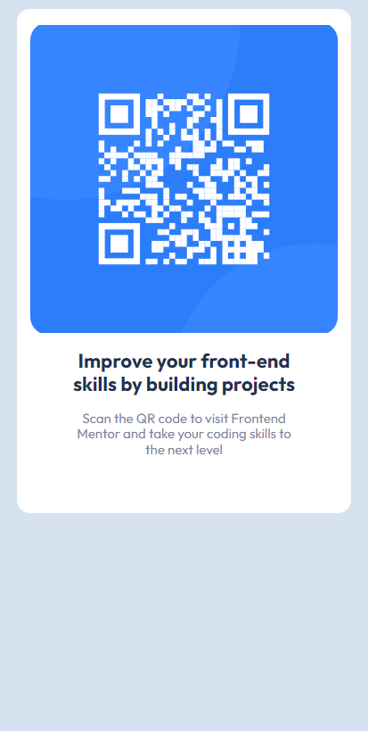

# Frontend Mentor - QR code component solution

This is a solution to the [QR code component challenge on Frontend Mentor](https://www.frontendmentor.io/challenges/qr-code-component-iux_sIO_H). Frontend Mentor challenges help you improve your coding skills by building realistic projects. 

## Table of contents

- [Overview](#overview)
  - [Screenshot](#screenshot)
  - [Links](#links)
- [My process](#my-process)
  - [Built with](#built-with)
  - [What I learned](#what-i-learned)
  - [Continued development](#continued-development)
  - [Useful resources](#useful-resources)
- [Author](#author)
- [Acknowledgments](#acknowledgments)

**Note: Delete this note and update the table of contents based on what sections you keep.**

## Overview

### Screenshot

### Links

- Solution URL: [https://github.com/ob-codes/FEM_QRCodeChallenge]
- Live Site URL: [https://ob-codes.github.io/FEM_QRCodeChallenge/]

## My process
Make and constantly iterate until my solution matched the provided design file.
### Built with

- Semantic HTML5 markup
- CSS custom properties

### What I learned

Learned the basics of a fixed design layout. Also learned how to use FEM portal.

### Continued development

Gonna use Flexbox for next challenge.
## Author

- Website - [https://www.ob.soitsol.com]
- Frontend Mentor - [@yourusername](https://www.frontendmentor.io/profile/yourusername)
- Twitter - [@ob_thoughts](https://www.twitter.com/ob_thoughts)

## Acknowledgments

I would like to shout out EllieZub for inspiring mw to try FEM. Her skills are worth mentioning. Check out her profile at [@elliezub](https://www.frontendmentor.io/profile/elliezub)
